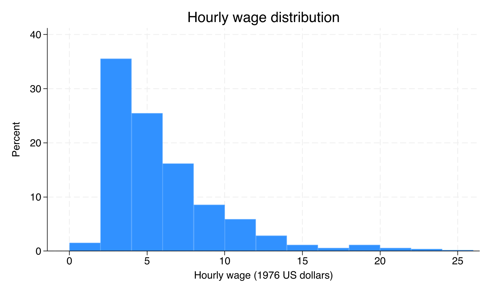
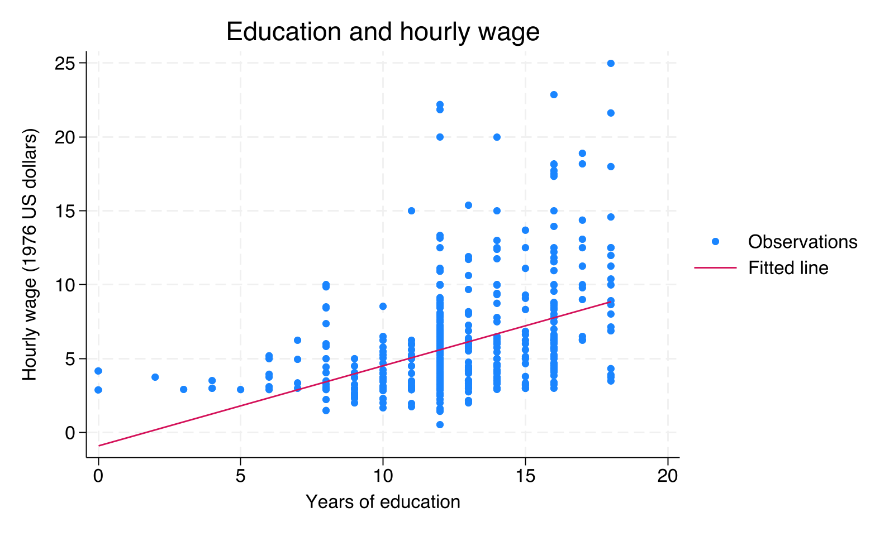

# 硕士第一次作业参考样本：教育与工资

本报告对应 [main.do](main.do) 的实际运行结果。观察单位为劳动者，仅分析 wage、educ、exper、female 四个变量。

## 1. 变量字典

| 变量 | 含义 | 单位或编码 |
|---|---|---|
| wage | 平均小时工资 | 美元/小时，1976 年名义美元 |
| educ | 受教育年限 | 年 |
| exper | 潜在工作经验 | 年；不能直接当作实际工作经历 |
| female | 性别指标 | 1=女性，0=男性；均值为女性样本比例 |

WAGE1 的公开说明将数据来源记为 1976 年美国 Current Population Survey，并列出以上变量定义。[数据说明](https://justinmshea.github.io/wooldridge/reference/wage1.html)

## 2. 缺失检查和样本筛选

| 变量 | 非缺失数 | 缺失数 |
|---|---:|---:|
| wage | 526 | 0 |
| educ | 526 | 0 |
| exper | 526 | 0 |
| female | 526 | 0 |

筛选规则：删除上述四个变量中任意一个存在缺失的观察。筛选前 526 条，删除 0 条，筛选后 526 条。没有按工资高低、教育年限、性别等进一步删样本，也未进行缩尾或加权。

`keep wage educ exper female` 只保留所用的列，不删除观察；`drop if missing(...)` 才是本例的行筛选。这里的无缺失结论仅针对本次四个变量。

## 3. 描述性统计

| 变量 | 样本数 | 均值 | 标准差 | 最小值 | 中位数 | 最大值 |
|---|---:|---:|---:|---:|---:|---:|
| wage | 526 | 5.896 | 3.693 | 0.530 | 4.650 | 24.980 |
| educ | 526 | 12.563 | 2.769 | 0.000 | 12.000 | 18.000 |
| exper | 526 | 17.017 | 13.572 | 1.000 | 13.500 | 51.000 |
| female | 526 | 0.479 | 0.500 | 0.000 | 0.000 | 1.000 |

数值直接整理自运行日志中的 `tabstat` 输出，保留三位小数。女性样本比例约为 47.9%；0/1 变量的均值可以这样解释。

## 4. 两张图

### 工资分布图

横轴为小时工资，纵轴为每个工资区间内观察数占样本的百分比；组距为 2 美元。

### 教育与工资关系图

每个点是一名劳动者，直线是对样本关系的线性概括。样本相关系数为 0.4059；图中直线不是已经识别出的因果效应。

## 5. 200 字解释

本样本有526名劳动者，四个变量均无缺失。平均小时工资为5.90美元，中位数为4.65美元，分布呈右偏。教育年限与工资的相关系数约为0.406，散点图及拟合线显示正向样本关联。但这不能说明多受教育会提高工资，因为能力、家庭背景等因素可能同时影响教育选择和工资，样本构成可能影响结果。潜在工作经验不等于实际工作经历。因此，图表适合描述样本，不足以识别教育的因果效应；因果结论还需要可信的研究设计和假设。

## 6. 运行记录

- 主程序：[main.do](main.do)。
- 完整运行日志：[results/run.log](results/run.log)。变量字典、缺失检查、样本筛选和统计命令都保留在日志中。
- 本次实际运行软件：Stata 19.5；程序使用 Stata 17 语法。
- 本次实际工作目录：`/private/tmp/econometrics_hw01_sample`；这是教师运行样本时使用的位置，同学们应设置自己的样本文件夹。
- 输入路径：`data/WAGE1.DTA`，与课程原有 `作业/Data/WAGE1.DTA` 内容完全一致。
- 输出路径：`results/`。重新运行会更新同名日志和图片，不会改写原始数据。

同学们可以从日志中找到每个表格和图形对应的命令。自选数据或更换变量后，请按实际结果重新填写字典、统计表和解释。
